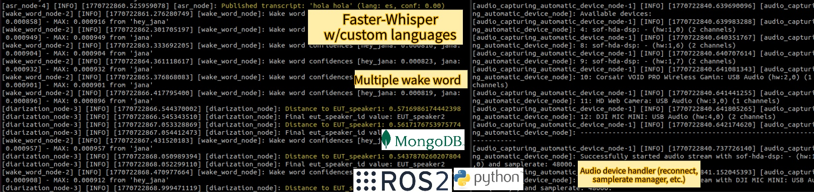

# EutSpeechAudioProcessing: Audio Stream Management, VAD, Speaker Diarization, Wake Word Detection & Speech Recognition

[](https://github.com/Eurecat/eut_speech_audio_processing/actions/workflows/ci-cd.yml?query=branch%3Ajazzy-devel)
[](https://github.com/Eurecat/eut_speech_audio_processing/actions/workflows/ci-cd.yml)
[](https://github.com/Eurecat/eut_speech_audio_processing/actions/workflows/ci-cd.yml)

🚀 Production-ready ROS2 (Jazzy, Humble-WIP) audio perception stack with **advanced VAD and speaker diarization** 🗣️ and **state-of-the-art Whisper ASR** 📝. Uniquely integrates **MongoDB** 💾 for persistent speaker embedding storage with automatic re-identification across sessions—speaker identities survive Docker restarts! Fully containerized architecture with hardware-isolated audio management and modular speech processing pipeline for enterprise-grade human-robot interaction.

## 🏗️ Architecture Overview

<p align="center">
  
  <br>
  <em>Audio Perception Stack Architecture</em>
</p>

**EutSpeechAudioProcessing** provides end-to-end audio perception for robotics, from hardware audio capture to speech understanding.

## Key Features

- 🎤 **Hardware-Isolated Audio Capture**: Robust audio stream management with automatic device detection and error recovery
- 🗣️ **Voice Activity Detection (VAD)**: Real-time speech segment detection with configurable sensitivity
- 👥 **Speaker Diarization with Persistence**: Multi-speaker identification using deep learning embeddings stored in MongoDB—**speaker identities persist across Docker restarts and robot sessions**
- 📝 **State-of-the-Art ASR**: High-accuracy speech transcription powered by OpenAI Whisper models
- 🔊 **Wake Word Detection**: Configurable keyword spotting for hands-free voice activation
- 🗄️ **MongoDB Database**: Automatic speaker embedding storage and re-identification with persistent identity management
- 🐳 **Decoupled Architecture**: Hardware management and speech processing run in separate containers for maximum reliability
- ⚙️ **Modular Pipeline**: Enable/disable VAD, diarization, wake word, and ASR independently based on your needs

<p align="center">
  
  <br>
  <em>Expected Pipeline Logs During Operation</em>
</p>

## Overview

This repository contains the **speech and audio processing module** for the perception layer of robotic systems, enabling comprehensive audio understanding and natural human-robot interaction through voice.

### Architecture

The system features a **decoupled two-component architecture** for robust operation and reliability:

#### 🎙️ **Audio Stream Manager**
Hardware-isolated audio capture that interfaces directly with audio devices, preventing hardware issues from affecting the speech processing pipeline.

#### 🧠 **Speech Recognition Pipeline**
A modular processing chain that transforms raw audio into actionable insights:
  - **Voice Activity Detection (VAD)**: Detects when speech is present in the audio stream
  - **Speaker Diarization**: Identifies and segments different speakers with **persistent identity storage in MongoDB**—speaker embeddings survive container restarts and system reboots
  - **Wake Word Detection**: Keyword spotting for voice activation  
  - **Speech Transcription**: Converts spoken language into text using automatic speech recognition (ASR)

**🔑 Unique Feature**: Unlike traditional solutions, speaker identities are **automatically saved to MongoDB and reloaded on startup**, enabling seamless speaker re-identification across sessions without manual re-enrollment.

---

## 🚀 Quick Start

### Installation & Setup

#### Step 0: Build Base Image
First, build the required base Docker image from [EutRobAIDockers](https://github.com/Eurecat/EutRobAIDockers).
```bash
git clone git@github.com:Eurecat/EutRobAIDockers.git
cd EutRobAIDockers
./build_container.sh 
# Defaults to ROS2 Jazzy and GPU
# Optionally, use --clean-rebuild to force a complete rebuild without cached layers. --cpu flag can be used to build a CPU-only image if needed. etc.
```

#### Step 1: Clone Repository
```bash
git clone git@github.com:Eurecat/eut_speech_audio_processing.git
cd eut_speech_audio_processing
```

#### Step 2: Build Application Image

For Vulcanexus-based installations:
```bash
cd Docker && ./build_container.sh --vulcanexus
```

For standard installations:
```bash
cd Docker && ./build_container.sh
```

**Build Options:**
- Use `--clean-rebuild` flag to force a complete rebuild without cached layers

### Configuration Parameters

**Hugging Face Token Setup:**  
Configure your Hugging Face token in the `.env` file (see `.env.example` for template) to access state-of-the-art models:

- `openai/whisper` - Advanced speech recognition
- `pyannote/embedding` - Speaker voice embeddings
- `pyannote/segmentation` - Speaker diarization

Ensure your token has appropriate permissions for these model repositories.


## Usage

### Docker Compose (Recommended)

Navigate to the Docker directory and launch both services simultaneously:

```bash
cd Docker
docker compose up
```

This command will initialize both the **Audio Stream Manager** and the **Speech Recognition Pipeline** services automatically.

**Microphone Selection:**
1. Check detected audio devices:
   ```bash
   docker logs audio_device_manager
   ```
   Example output shows available devices with their hardware IDs.

2. Modify device_name with the desired one in [audio_params.yaml](./src/audio_stream_manager/config/audio_params.yaml)

3. Restart only the audio service:
   ```bash
   docker restart audio_device_manager
   ```

#### Service Configuration

The Docker Compose setup includes two main services:

1. **Audio Device Manager Service**: Handles audio input device selection and stream management
2. **Speech Recognition Service**: Provides VAD, diarization, wake word and ASR capabilities

#### Enabling/Disabling Components

You can selectively enable or disable speech recognition components by editing the `command` section in the `dev-docker-compose.yaml` file. Modify the speech recognition service command as follows:

```bash
# Example: Disable diarization and ASR, keep only VAD
command: bash -c "source /workspace/install/setup.bash && ros2 launch speech_recognition speech_recognition.launch.py enable_diarization:=false enable_asr:=false"
```

**Available options:**
- `enable_vad:=true/false` - Voice Activity Detection
- `enable_diarization:=true/false` - Speaker Diarization  
- `enable_wake_word:=true/false`- Wake Word
- `enable_asr:=true/false` - Automatic Speech Recognition

**Important Dependencies:**
- **Diarization** requires **VAD** to work properly
- **ASR** requires both **VAD** and **Diarization** for optimal performance


### Managing the Speaker Recognition Database

The speaker diarization system uses **MongoDB to persistently store speaker voice embeddings**, enabling automatic re-identification across Docker container restarts and robot sessions. Once a speaker is enrolled, their voice profile remains in the database indefinitely.

**Query the database:**
```bash
mongosh
use speaker_recognition
db.speakers.find()
```

**Access the web interface:**  
[http://0.0.0.0:8081/db/speaker_recognition/speakers](http://0.0.0.0:8081/db/speaker_recognition/speakers)

**Delete the database:**  
Remove the associated Docker volume to clear all speaker embeddings and start fresh.

This persistence means your robot can recognize previously encountered speakers without re-enrollment, making interactions more natural and continuous across sessions.

#### Formatting code - Pre-commit Hooks (Optional but Recommended)

This repository uses **Ruff** for automatic Python code formatting via pre-commit hooks.

**Quick Setup:**

```bash
# Install pre-commit
pip install pre-commit

# Install the git hooks 
pre-commit install # Runs on changed files only by default when git commit

# (Optional) Run on all existing files
pre-commit run --all-files

#If you need to commit urgently and skip the pre-commit checks
git commit -m "urgent fix" --no-verify
```
Now Ruff will automatically format your code before each commit. If formatting changes are made, review them with `git diff`, then stage and commit again.

Follow [PRECOMMIT.md](./PRECOMMIT.md) for detailed instructions and troubleshooting tips related to pre-commit hooks.

---

## Troubleshooting

### Port 27017 Already in Use

If you encounter the error `failed to bind host port for 0.0.0.0:27017:172.21.0.2:27017/tcp: address already in use`, this means another service is already occupying port 27017. The docker-compose MongoDB service cannot start because the port is blocked. To resolve this, identify and stop the conflicting service with `sudo lsof -i :27017` and kill the process if needed, then restart docker-compose. 

```bash
sudo lsof -ti:27017 | xargs -r sudo kill -9
```
### Container Name Conflicts

If you switch between `dev-docker-compose.yaml` and `docker-compose.yaml`, you may encounter errors like `Conflict. The container name "/mongodb_faces" is already in use`. This happens because containers from the previous compose file are still running. To resolve this, remove all containers and restart: 
```bash
docker rm -f $(docker ps -aq)
```
then run `docker compose up` again. This cleanly removes all existing containers and allows the new composition to start fresh.


### Setup for Local Testing

1. **Configure secrets** (if needed for your workflow):
   ```bash
   # Create a secrets file
   touch .secrets
   
   # Add your secrets (example):
   echo "HF_TOKEN=your_huggingface_token_here" >> .secrets
   ```

   ⚠️ **Important**: Don't commit the `.secrets` file to GitHub! Add it to `.gitignore`:
   ```bash
   echo ".secrets" >> .gitignore
   ```

### Running CI/CD Locally

Follow [CI_CD_SETUP.md](CI_CD_SETUP.md) for detailed instructions on how to run GitHub Actions workflows locally.

---

## License

Apache-2.0

## Maintainers
- [Josep Bravo](https://github.com/LeBrav)
- [Joan Omedes](https://github.com/joan-omedes)  
- [Devis Dal Moro](https://github.com/devis12)