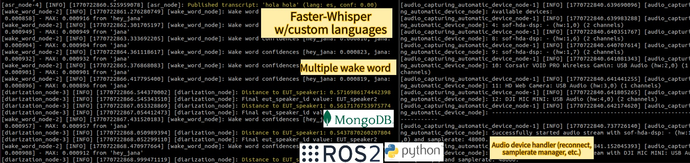

# EutSpeechAudioProcessing: Audio Stream Management, VAD, Speaker Diarization, Wake Word Detection & Speech Recognition

🚀 Production-ready ROS2 (Jazzy, Humble) audio perception stack with **advanced VAD and speaker diarization** 🗣️ and **state-of-the-art Whisper ASR** 📝. Uniquely integrates **MongoDB** 💾 for persistent speaker embedding storage with automatic re-identification across sessions—speaker identities survive Docker restarts! Fully containerized architecture with hardware-isolated audio management and modular speech processing pipeline for enterprise-grade human-robot interaction. Based on the [ros4hri](https://github.com/ros4hri) 🤖 standard, with an optional ROS4HRI-compatible publication mode. The default configuration uses a scalability-oriented architecture, leveraging state-of-the-art open-source AI models in an enterprise-grade architecture.

## 🏗️ Architecture Overview

<p align="center">
  
  <br>
  <em>Audio Perception Stack Architecture</em>
</p>

**EutSpeechAudioProcessing** provides end-to-end audio perception for robotics, from hardware audio capture to speech understanding.

## Key Features

- 🎤 **Hardware-Isolated Audio Capture**: Robust audio stream management with automatic device detection and error recovery
- 🗣️ **Voice Activity Detection (VAD)**: Real-time speech segment detection with configurable sensitivity
- 👥 **Speaker Diarization with Persistence**: Multi-speaker identification using deep learning embeddings stored in MongoDB—**speaker identities persist across Docker restarts and robot sessions**
- 📝 **State-of-the-Art ASR**: High-accuracy speech transcription powered by OpenAI Whisper models, or NVIDIA Parakeet TDT (`asr_backend: parakeet`, faster, 25 European languages, no Catalan), selectable in `asr_params.yaml` or with `ASR_BACKEND` in `Docker/.env`
- 🔊 **Wake Word Detection**: Configurable keyword spotting for hands-free voice activation
- 🗄️ **MongoDB Database**: Automatic speaker embedding storage and re-identification with persistent identity management
- 🐳 **Decoupled Architecture**: Hardware management and speech processing run in separate containers for maximum reliability
- ⚙️ **Modular Pipeline**: Enable/disable VAD, diarization, wake word, and ASR independently based on your needs

<p align="center">
  
  <br>
  <em>Expected Pipeline Logs During Operation</em>
</p>

## Overview

This repository contains the **speech and audio processing module** for the perception layer of robotic systems, enabling comprehensive audio understanding and natural human-robot interaction through voice.

### Architecture

The system features a **decoupled two-component architecture** for robust operation and reliability:

#### 🎙️ **Audio Stream Manager**
Hardware-isolated audio capture that interfaces directly with audio devices, preventing hardware issues from affecting the speech processing pipeline. Follows a decoupled design: the `AudioCapturing` ROS2 node is a thin wrapper that only handles parameters and publishing, while `AudioCaptureEngine` owns all audio logic (device discovery, streaming, resampling, fallback, recovery) with no ROS2 dependencies. A dedicated `DeviceWatchdog` runs background threads for disconnection detection and primary-device recovery. The `utils/` module provides reusable helpers: `SoundDeviceManager` for device queries and stream lifecycle, `ActiveDevice` dataclass for device state, and pure functions for audio resampling and RMS computation.

#### 🧠 **Speech Recognition Pipeline**
A modular processing chain that transforms raw audio into actionable insights:
  - **Voice Activity Detection (VAD)**: Detects when speech is present in the audio stream
  - **Speaker Diarization**: Identifies and segments different speakers with **persistent identity storage in MongoDB**—speaker embeddings survive container restarts and system reboots
  - **Wake Word Detection**: Keyword spotting for voice activation  
  - **Speech Transcription**: Converts spoken language into text using automatic speech recognition (ASR)

**🔑 Unique Feature**: Unlike traditional solutions, speaker identities are **automatically saved to MongoDB and reloaded on startup**, enabling seamless speaker re-identification across sessions without manual re-enrollment.

---

## 🚀 Quick Start

### Installation & Setup

#### Step 0: Build Base Image
First, build the required base Docker image from [EutRobAIDockers](https://github.com/Eurecat/EutRobAIDockers).
```bash
git clone git@github.com:Eurecat/EutRobAIDockers.git
cd EutRobAIDockers
./build_container.sh 
# Defaults to ROS2 Jazzy and GPU
# Optionally, use --clean-rebuild to force a complete rebuild without cached layers. --cpu flag can be used to build a CPU-only image if needed. etc.
```

#### Step 1: Clone Repository
```bash
git clone git@github.com:Eurecat/eut_speech_audio_processing.git
cd eut_speech_audio_processing
```

#### Step 2: Build Application Image

For Vulcanexus-based installations:
```bash
cd Docker && ./build_container.sh --vulcanexus
```

For standard installations:
```bash
cd Docker && ./build_container.sh
```

**Build Options:**
- Use `--clean-rebuild` flag to force a complete rebuild without cached layers

### Configuration Parameters

**Hugging Face Token Setup:**  
Configure your Hugging Face token in the `.env` file (see `.env.example` for template) to access state-of-the-art models:

- `openai/whisper` - Advanced speech recognition
- `nvidia/parakeet-tdt-0.6b-v3` - Speech recognition with `asr_backend: parakeet` (public, no token needed)
- `pyannote/embedding` - Speaker voice embeddings
- `pyannote/segmentation` - Speaker diarization

Ensure your token has appropriate permissions for these model repositories.

**Model weights (shared folder, never in the image):**
All models download once to the host folder `src/speech_recognition/speech_recognition/weights/`,
which every compose file bind-mounts at `/workspace/weights` (`WEIGHTS_DIR`), the same pattern as
the other EutPerceptionStack repos. `.dockerignore` keeps it out of the image build.

| Model | Location inside `weights/` |
|---|---|
| Whisper (`models--*faster-whisper*`), Parakeet (`models--nvidia--parakeet-*`) | root |
| Silero VAD (`snakers4_silero-vad_master`) | root |
| pyannote segmentation / embedding (`PYANNOTE_CACHE`) | `pyannote/` |
| ReDimNet2 torch hub (`TORCH_HOME`) | `torch/hub/` |
| Parakeet language identification (`langid_ambernet`) | `nemo/` |
| Other Hugging Face downloads (`HF_HOME`) | `huggingface/` |

Upgrading from the old layout: pyannote models lived in `speech_recognition/weights_pyannote/`.
Move them once so the gated models do not need `HF_TOKEN` again:
`sudo mv src/speech_recognition/speech_recognition/weights_pyannote src/speech_recognition/speech_recognition/weights/pyannote`


## Usage

### Docker Compose (Recommended)

Navigate to the Docker directory and launch both services simultaneously:

```bash
cd Docker
docker compose up
```

This command will initialize both the **Audio Stream Manager** and the **Speech Recognition Pipeline** services automatically.

**Microphone Selection:**
1. Check detected audio devices:
   ```bash
   docker logs audio_device_manager
   ```
   Example output shows available devices with their hardware IDs.

2. Modify device_name with the desired one in [audio_params.yaml](./src/audio_stream_manager/config/audio_params.yaml)

3. Restart only the audio service:
   ```bash
   docker restart audio_device_manager
   ```

#### Service Configuration

The Docker Compose setup includes two main services:

1. **Audio Device Manager Service**: Handles audio input device selection and stream management
2. **Speech Recognition Service**: Provides VAD, diarization, wake word and ASR capabilities

#### Enabling/Disabling Components

You can selectively enable or disable speech recognition components by editing the `command` section in the `dev-docker-compose.yaml` file. Modify the speech recognition service command as follows:

```bash
# Example: Disable diarization and ASR, keep only VAD
command: bash -c "source /workspace/install/setup.bash && ros2 launch speech_recognition speech_recognition.launch.py enable_diarization:=false enable_asr:=false"
```

**Available options:**
- `enable_vad:=true/false` - Voice Activity Detection
- `enable_diarization:=true/false` - Speaker Diarization  
- `enable_wake_word:=true/false`- Wake Word
- `enable_asr:=true/false` - Automatic Speech Recognition

**Important Dependencies:**
- **Diarization** requires **VAD** to work properly
- **ASR** requires both **VAD** and **Diarization** for optimal performance

### Android Edge Bridge Mode

This repository now includes an Android bridge profile that lets an Android app stream audio into ROS2 and receive `SpeechResult` back in real time.

Launch it from the Docker folder:

```bash
docker compose -f android-docker-compose.yaml up
```

The profile starts two TCP bridges in host network mode:

- Android -> edge audio ingest (`audio_stream_manager/android_audio_bridge.py`)
  - Binds on `0.0.0.0:${ANDROID_AUDIO_PORT:-17000}`
  - Accepts NDJSON messages and publishes `audio_and_device_info` (`AudioAndDeviceInfo.msg`)
- edge -> Android transcript egress (`speech_recognition/android_transcript_bridge.py`)
  - Binds on `0.0.0.0:${ANDROID_TRANSCRIPT_PORT:-17001}`
  - Subscribes to `speech_result` (`SpeechResult.msg`) and streams NDJSON to connected clients

#### Android -> edge NDJSON payloads

One JSON object per line over TCP:

```json
{"type":"stream_start","stream_id":"session-123"}
{"type":"audio_chunk","stream_id":"session-123","seq":1,"sample_rate":16000,"device_name":"pixel","device_id":1,"audio":[0.01,-0.02,0.03]}
{"type":"stream_end","stream_id":"session-123"}
```

`audio_chunk` also supports `audio_b64_f32le` as an alternative to the `audio` array.

#### edge -> Android NDJSON payload

One JSON object per line over TCP:

```json
{
  "type": "speech_result",
  "transcript": "hola",
  "transcript_confidence": 0.0,
  "speaker_id": "speaker_1",
  "speaker_id_confidence": 0.0,
  "language_code": "es",
  "locale": "",
  "stamp": {"sec": 1, "nanosec": 2000000}
}
```

#### Notes

- Both bridges use bounded queues to avoid unbounded memory growth.
- The audio bridge drops the oldest queued chunk when saturated and logs drop counters.
- Keep Android and host in the same network (or use ADB reverse/forward if needed).


### Managing the Speaker Recognition Database

The speaker diarization system uses **MongoDB to persistently store speaker voice embeddings**, enabling automatic re-identification across Docker container restarts and robot sessions. Once a speaker is enrolled, their voice profile remains in the database indefinitely.

**Query the database:**
```bash
mongosh
use speaker_recognition
db.speakers.find()
```

**Access the web interface:**  
[http://0.0.0.0:8081/db/speaker_recognition/speakers](http://0.0.0.0:8081/db/speaker_recognition/speakers)
user: admin
password: pass

**Delete the database:**  
Remove the associated Docker volume to clear all speaker embeddings and start fresh.

This persistence means your robot can recognize previously encountered speakers without re-enrollment, making interactions more natural and continuous across sessions.

#### Formatting code - Pre-commit Hooks (Optional but Recommended)

This repository uses **Ruff** for automatic Python code formatting via pre-commit hooks.

**Quick Setup:**

```bash
# Install pre-commit
pip install pre-commit

# Install the git hooks 
pre-commit install # Runs on changed files only by default when git commit

# (Optional) Run on all existing files
pre-commit run --all-files

#If you need to commit urgently and skip the pre-commit checks
git commit -m "urgent fix" --no-verify
```
Now Ruff will automatically format your code before each commit. If formatting changes are made, review them with `git diff`, then stage and commit again.

Follow [PRECOMMIT.md](./PRECOMMIT.md) for detailed instructions and troubleshooting tips related to pre-commit hooks.

---

## Troubleshooting

### Port 27017 Already in Use

If you encounter the error `failed to bind host port for 0.0.0.0:27017:172.21.0.2:27017/tcp: address already in use`, this means another service is already occupying port 27017. The docker-compose MongoDB service cannot start because the port is blocked. To resolve this, identify and stop the conflicting service with `sudo lsof -i :27017` and kill the process if needed, then restart docker-compose. 

```bash
sudo lsof -ti:27017 | xargs -r sudo kill -9
```

### Failed to Load Identity Database from MongoDB
If you encounter the error
```bash
 [ERROR] Failed to load identity database from MongoDB: localhost:27017: [Errno 111] Connection refused (configured timeouts: socketTimeoutMS: 20000.0ms, connectTimeoutMS: 20000.0ms), Timeout: 5.0s, Topology Description: <TopologyDescription id: 699c509d3119785fb03732f5, topology_type: Unknown, servers: [<ServerDescription ('localhost', 27017) server_type: Unknown, rtt: None, error=AutoReconnect('localhost:27017: [Errno 111] Connection refused (configured timeouts: socketTimeoutMS: 20000.0ms, connectTimeoutMS: 20000.0ms)')>]>
```

Then probably you have some bad configuration in your volumne of mongodb from previous compose, run compose down to remove all volumes and start again. When doing any change on the compose.yaml also do

```bash
docker compose down -v
docker compose up
```


### Container Name Conflicts

If you switch between `dev-docker-compose.yaml` and `docker-compose.yaml`, you may encounter errors like `Conflict. The container name "/mongodb_faces" is already in use`. This happens because containers from the previous compose file are still running. To resolve this, remove all containers and restart: 
```bash
docker stop $(docker ps -q) #or kill or rm to avoid losing data if you have any important container running
```
then run `docker compose up` again. This cleanly removes all existing containers and allows the new composition to start fresh.


### Microphone Stops Streaming After Minutes or Hours (USB Reset)

**Symptom.** Audio stops arriving, although the microphone is still connected and still appears in the device list. The `audio_capturing` log shows:

```
[ERROR] [audio_capturing]: No callback for 10.00 seconds. Device may be disconnected.
```

The `audio_to_mp3` log keeps the same `(N chunks)` count on every line.

**Cause.** The cause is outside this code. The Linux kernel resets the USB port of the microphone, and the kernel does not log a warning before the reset. The reset closes the ALSA capture stream inside the kernel. PortAudio does not report the closed stream, so the audio callback stops without an error. This can happen on any Linux PC or Jetson and with any USB microphone. It is more frequent when a full-speed (12 Mbit/s) audio device is connected through a USB 2.0 hub.

**What the node does.** The node detects the stopped callback after `disconnection_timeout` (10 s). It then reconnects to the device named by `DEVICE_NAME` in `Docker/.env`, and normally needs less than 100 ms. On success it logs:

```
[INFO] [audio_capturing]: Reconnected to audio device: Jabra SPEAK 510 USB: Audio (hw:2,0).
```

If the named device is not found, the node tries all other input devices. A device that gives no audio within `test_stream_timeout` (2 s) is skipped in later scans. For example, the 32 `NVIDIA Jetson Thor AGX APE` channels never give audio. Set `DEVICE_NAME` correctly, because otherwise the first full scan on a Jetson takes about 64 s.

> Before this fix, a reset stopped the microphone until a manual container restart. The recovery scan waited forever on the first APE channel, and the timeout was 300 s.

Automatic recovery still causes an audio gap of about 10 s for each reset. If the log shows `Reconnected to audio device` often, reduce the USB resets on the host as follows.

**1. Confirm that the kernel resets the microphone.** Run these commands on the host. `journalctl` does not need `sudo`.

```bash
# Find the USB path of the microphone, for example "usb-a80aa10000.usb-4.2" = port 1-4.2
cat /proc/asound/cards

# Show USB resets. A line with the same port confirms the problem.
journalctl -k | grep -E "reset (full|high|low)-speed USB device"
#   usb 1-4.2: reset full-speed USB device number 4 using tegra-xusb

# During a failure, the capture stream shows "closed" (replace 2 with your card number)
cat /proc/asound/card2/pcm0c/sub0/status
```

**2. Connect the microphone without a hub.** Run `lsusb -t`. If the audio device (`Driver=snd-usb-audio, 12M`) is below a `Class=Hub` line, move the microphone to a USB port on the PC or Jetson itself. On the Jetson AGX Thor used for development, the Jabra was behind a 4-port USB 2.0 hub, and a different device on the same hub was also reset 9 times in one day.

**3. Improve power and cable.** Use a powered USB hub or a short, good cable if you must use a hub or extension. Some speakerphones use up to 500 mA (`cat /sys/bus/usb/devices/<port>/bMaxPower`).

**4. Disable USB autosuspend for the microphone.** Check the value first:

```bash
cat /sys/bus/usb/devices/1-4.2/power/control   # "on" = autosuspend is disabled, skip this step
```

If the value is `auto`, add a udev rule. Get the vendor and product IDs from `lsusb`, for example `0b0e:0422` for the Jabra SPEAK 510:

```bash
echo 'ACTION=="add", SUBSYSTEM=="usb", ATTR{idVendor}=="0b0e", ATTR{idProduct}=="0422", TEST=="power/control", ATTR{power/control}="on"' \
  | sudo tee /etc/udev/rules.d/90-usb-mic-no-autosuspend.rules
sudo udevadm control --reload-rules && sudo udevadm trigger
```

**5. Test recovery on a new machine.** This command sends the same USB reset to the microphone. Use the bus and device numbers from `lsusb`, for example `Bus 001 Device 004`:

```bash
docker exec audio_device_manager python3 -c "import fcntl,os; fd=os.open('/dev/bus/usb/001/004', os.O_WRONLY); fcntl.ioctl(fd, ord('U')<<8|20, 0)"
```

Within about 10 s the log must show `Reconnected to audio device`.


### Setup for Local Testing

1. **Configure secrets** (if needed for your workflow):
   ```bash
   # Create a secrets file
   touch .secrets
   
   # Add your secrets (example):
   echo "HF_TOKEN=your_huggingface_token_here" >> .secrets
   ```

   ⚠️ **Important**: Don't commit the `.secrets` file to GitHub! Add it to `.gitignore`:
   ```bash
   echo ".secrets" >> .gitignore
   ```

### Running CI/CD Locally

Follow [CI_CD_SETUP.md](CI_CD_SETUP.md) for detailed instructions on how to run GitHub Actions workflows locally.

---

## License

Apache-2.0

## Maintainers
- [Josep Bravo](https://github.com/LeBrav)
- [Joan Omedes](https://github.com/joan-omedes)  
- [Devis Dal Moro](https://github.com/devis12)
